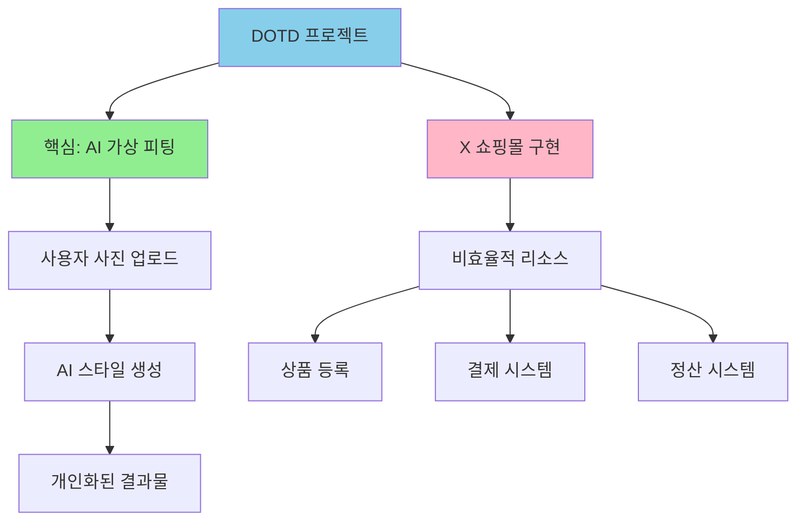
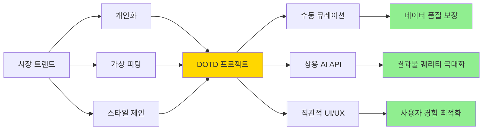
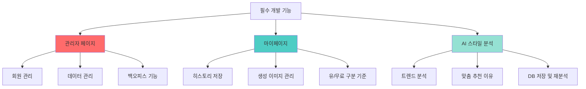
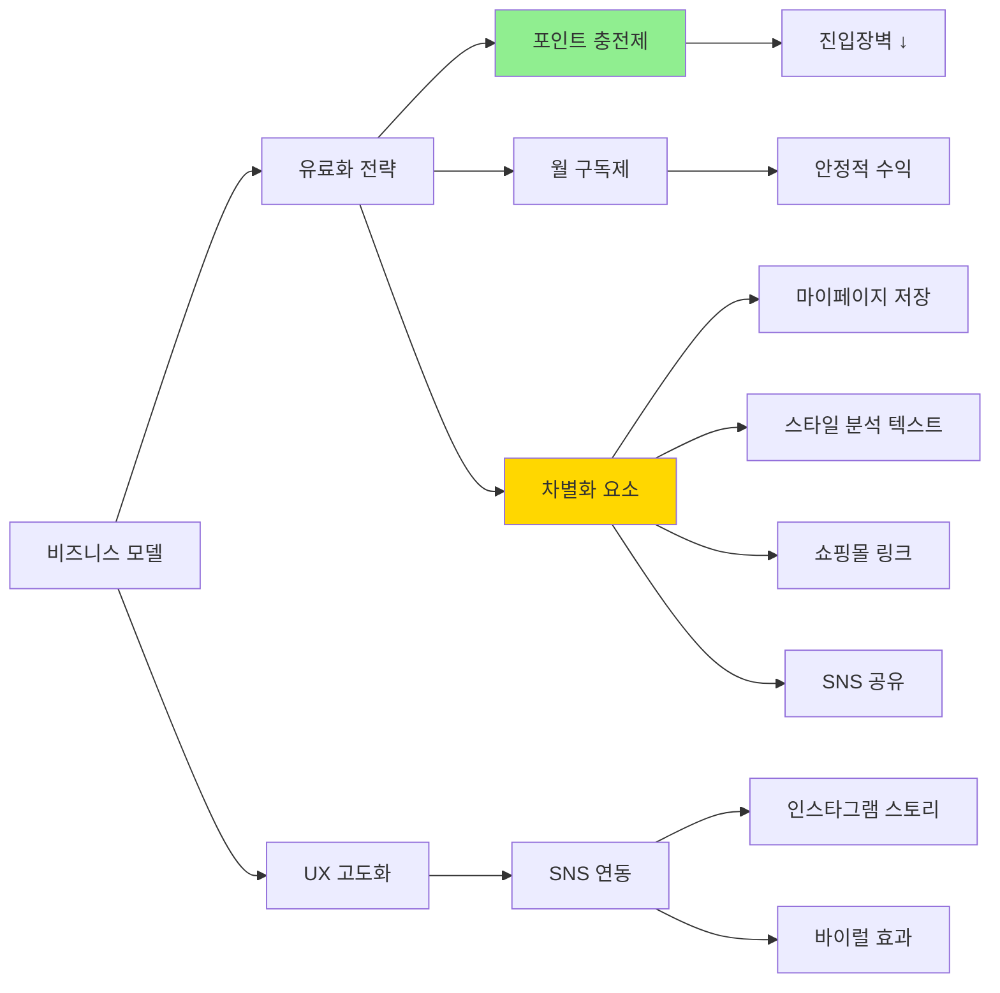
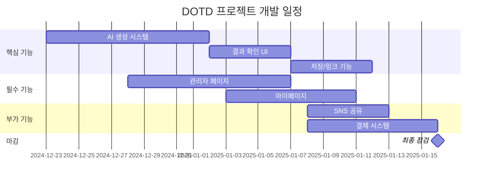
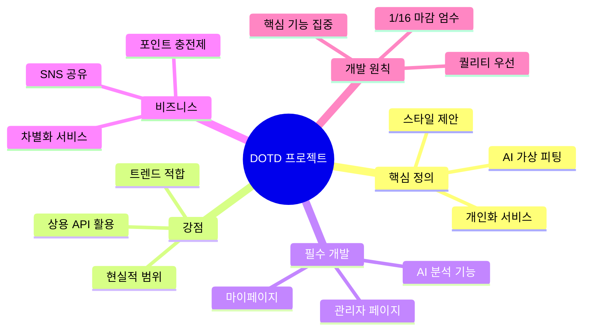

# DOTD 프로젝트 멘토링 피드백 정리

## 1. 객관적 진단 (현재 상황 및 방향성에 대한 분석)

### 프로젝트의 핵심 정의
이 프로젝트는 '쇼핑몰'을 만드는 것이 아니라, 사용자가 업로드한 사진을 기반으로 최신 트렌드나 특정 스타일을 입혀주는 **'AI 가상 피팅 및 스타일 제안'**이 핵심임.

### 쇼핑몰 구현의 비효율성
쇼핑몰을 직접 구현하는 것은 상품 등록, 결제, 정산 등 엄청난 리소스가 들어가는 작업임. 프로젝트 기간 내 계획된 핵심 기능(AI 생성)에 집중하는 게 좋은 선택.

### 크롤링의 현실적 한계
모든 웹사이트를 크롤링하여 데이터를 수집하는 것은 기술적으로나 법적으로 매우 어렵고 방대함. '모든 것을 다 가져온다'는 접근보다는 범위를 좁히는 것이 현실적임.

### 서비스의 성격 (B2C)
이 서비스는 개인화된 서비스(B2C)이므로, 사용자 편의성을 위한 기능(마이페이지 등)과 이를 관리하기 위한 관리자 기능이 필수적임.

### 비즈니스 모델(BM)의 설득력
월 7,900원 구독료가 공급자와 사용자 모두 설득할 수 있을지가 포인트. 유료 결제에 더 확실한 체계 분석 및 가치 제안(Value Proposition)이 있다면 좋겠음.

---

## 2. 멘토님 긍정적 피드백

### 트렌드 적합성
현재 패션 이커머스 시장에서 '개인화', '가상 피팅', '스타일 제안'은 가장 중요한 트렌드임. 팀의 주제와 방향성은 시장의 니즈와 잘 맞아떨어짐.

### 수동 큐레이션(데이터 입력) 방식
기술적으로 모든 것을 자동화하려 하기보다, 관리자가 특정 URL이나 이미지를 수동으로 입력하여 DB화 하겠다는 접근 방식은, 데이터의 퀄리티를 보장하고 프로젝트 범위를 현실화했다는 점에서 매우 칭찬할 만함 (무궁무진한 아이디어를 현실적으로 좁힌 점).

### AI 모델 활용 전략
오픈소스 모델을 고집하지 않고, 제미나이(Gemini)나 GPT 같은 유료/상용 API를 활용하여 결과물의 퀄리티를 높이려는 접근은 포트폴리오 관점에서 매우 현명한 선택임. (직접 모델을 만드는 것보다 결과물의 질이 훨씬 중요함).

### UI/UX 구성
결과물을 보여주고, 그 결과물이 마음에 들면 저장, 공유하게 유도하는 흐름이 사용자 입장에서 잘 설계된 그림임.

---

## 3. 앞으로 하면 좋을 지점 (Action Plan)

*(\*부팀장님과 운영 측면 회의 진행 후 방향도 전달드리겠습니다!)*

### [데이터 수집 및 관리]

#### 수동 입력 기능 강화
관리자가 특정 쇼핑몰 URL을 넣어 한 페이지 정보를 긁어와 DB에 등록해 활용하는 기능을 시연 시 작동하도록 보여주는 것도 중요

---

### [필수 개발 기능]

#### 관리자(Admin) 페이지 구축 ★필수
- **회원 관리 및 데이터 관리 기능**: 크롤링 된 데이터 확인/삭제, 수동 데이터 업로드
- **백오피스 화면**: 타인(회사)도 서비스 운영할 수 있는 관리자 화면이 반드시 있어야 함

#### 마이페이지 (My Page)
- 사용자가 생성한 AI 코디 이미지를 저장하고 다시 볼 수 있는 **'히스토리' 기능**이 유/무료 가르는 기준이 될 수 있음

#### 상세 스타일 설명의 AI 활용
생성 이미지를 보여주는 것 이상으로, "왜 이 옷이 당신에게 어울리는지", "어떤 트렌드를 반영했는지"에 입력되는 사용자 Trend Insight를 DB에 저장하며, AI로 재분석하여 맞춤 형식으로 추가 서비스를 제공해줄 수 있음.

---

### [비즈니스 모델 및 UX 고도화]

#### 유료화 모델 구체화
- **포인트 충전 방식**: 단순 월 구독보다는 '포인트 충전(건당 결제)' 방식이 초기 진입 장벽을 낮추는 데 유리할 수 있음 (예: 1회 생성 400원). 신용카드, 계좌이체 등 AI 결제 시스템 참고할 것.
- **유료 서비스 차별화**: 마이페이지 저장, 상세 스타일 분석 텍스트 제공, 쇼핑몰 링크 연결, SNS 공유 기능 등 '소유'와 '정보' 가치를 세분화하여 사용자에 공급하는 가치를 구분해볼 수 있음.

#### SNS 공유 기능
생성된 결과물을 인스타그램 스토리 등에 바로 공유할 수 있는 버튼/기능 실행 가능선에서 시도해보면 좋겠음.

---

### [개발 리소스 관리]

#### 외부 API 적극 활용
유료 API(제미나이, GPT-4 등)를 사용하여 최상의 퀄리티를 뽑아내는 데 집중할 것. 비용이 들더라도 포트폴리오 퀄리티가 우선임.

#### 기간 엄수
1월 16일까지 모든 것을 완벽하게 하려 하지 말고, 위에서 언급한 핵심 기능(생성 → 결과 확인 → 저장/링크)이 매끄럽게 돌아가는 것에 집중할 것.

---

## 핵심 요약

