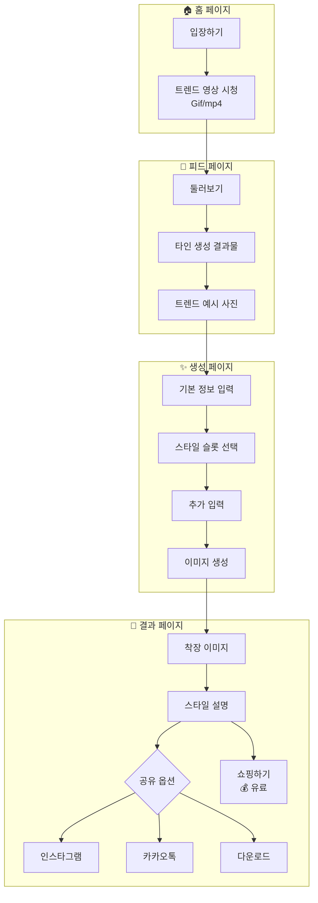
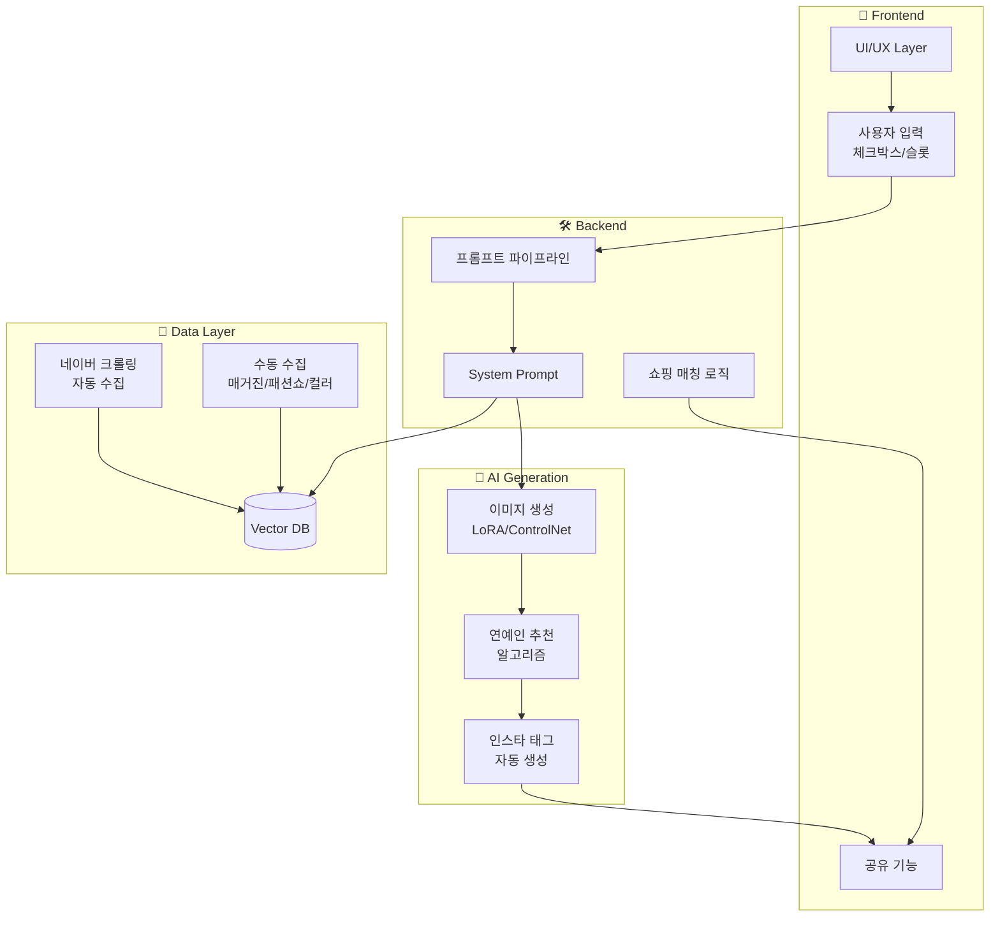
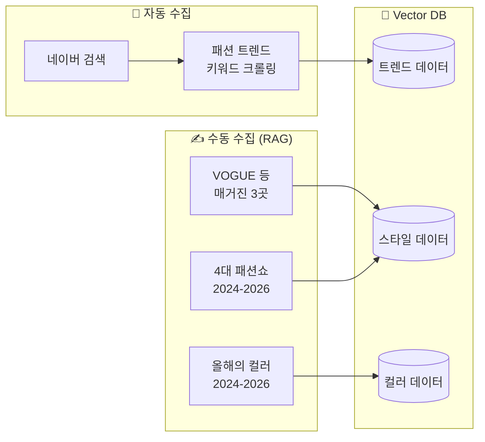
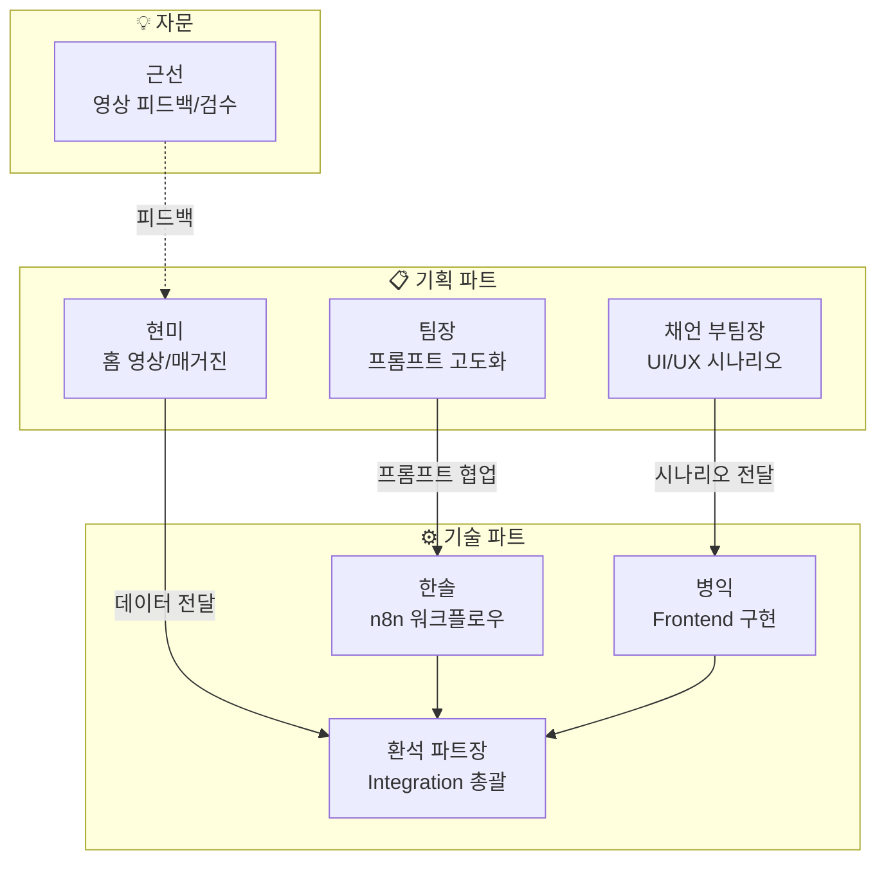
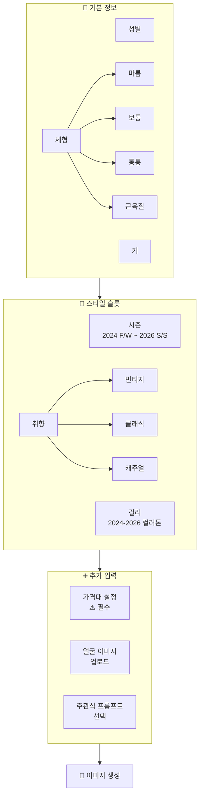
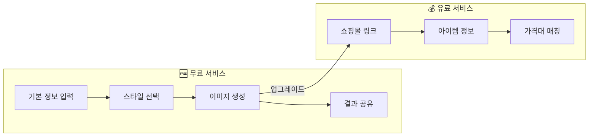
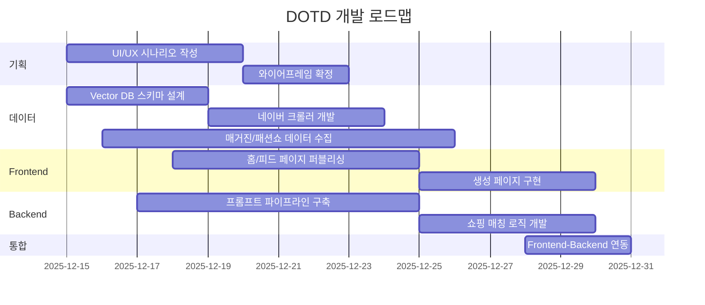
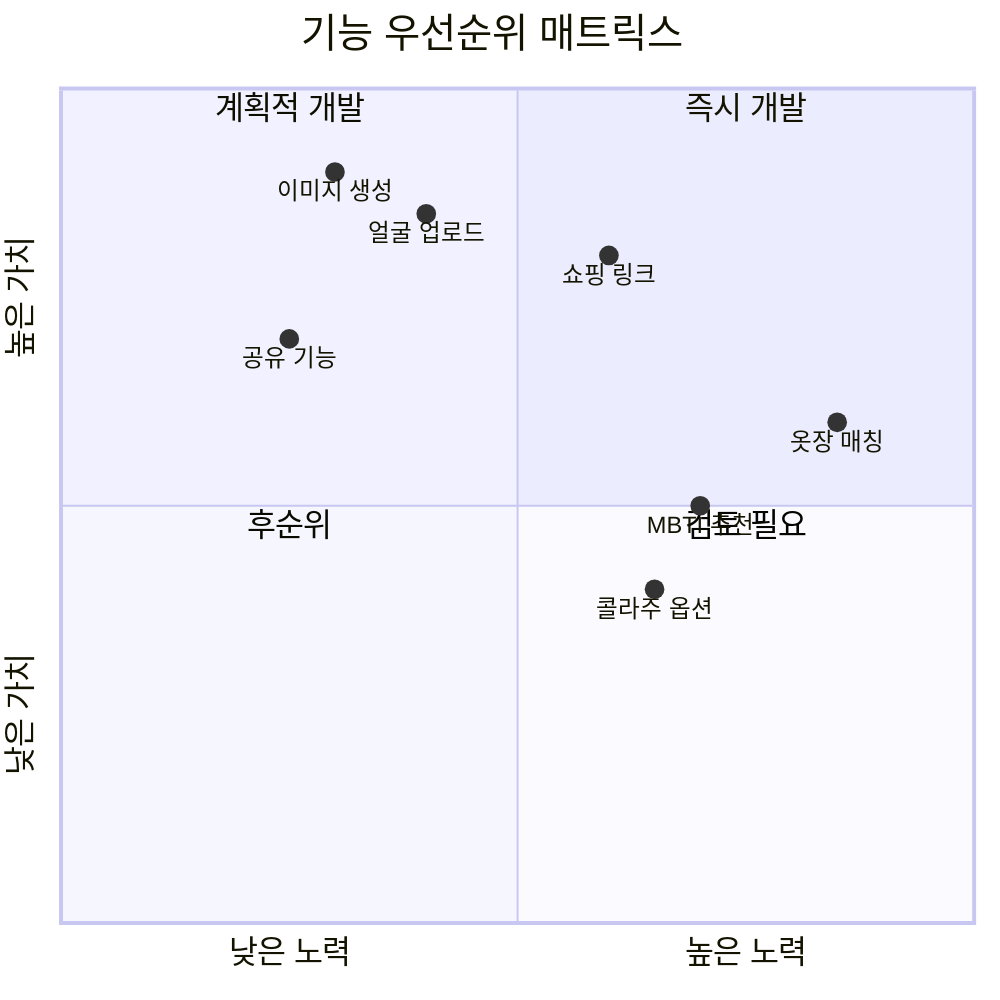

# 📝 [DOTD] 제작 기획안_251215

---

## 1. 🎨 Frontend (UI/UX 및 로직 구현)

### 1) 웹페이지 진입 & 플로우

- **홈 페이지 (입장하기):**
  - 후킹 요소: "나도 이렇게 입고 싶어"라는 욕구를 자극하는 최신 트렌드 영상 배치 (Gif or mp4).

- **피드 페이지 (둘러보기):**
  - 구성: 타인의 생성 결과물 및 트렌드 예시 사진 나열.
  - 목적: "사람들은 어떻게 입었지?" → "나도 해보자"로 이어지는 동기 부여.

### 2) 생성 페이지 (입력 로직)

- **기본 정보 (체크박스):** 성별, 키, 체형(마름, 보통, 통통, 근육질) 선택.
- **스타일 슬롯 (다중 선택):**
  - 시즌: 2024 F/W ~ 2026 S/S (4대 패션쇼 기준).
  - 컬러: 2024 ~ 2026 올해의 컬러톤.
  - 취향: 빈티지, 클래식, 캐주얼 등.
- **추가 입력:** 가격대 설정(필수), 얼굴 이미지 업로드, 주관식 프롬프트(선택).

### 3) 결과 및 공유 페이지

- **결과 화면:** 생성된 착장 이미지 + 스타일 간략 설명 제공.
- **공유 기능:** 인스타그램/카카오톡 공유 및 디바이스 다운로드 지원.
- **쇼핑하기 (유료):** 결과 페이지 하단에 입력한 가격대에 맞는 추천 쇼핑몰 링크 및 아이템 정보 노출.

---

## 2. 🛠️ Backend & Data (데이터 및 로직)

### 1) 이미지 생성 프롬프트 파이프라인

- **프론트 연동:** 사용자가 입력한 체크박스/슬롯 값을 텍스트 프롬프트로 변환.
- **백엔드 지시사항 (System Prompt):**
  - DB 참조: 구축된 Vector DB 및 네이버 최신 트렌드 기사 반영.
  - 스타일링: 사용자 실물 기반 연예인 추천 알고리즘 적용.
  - 출력: 인스타그램용 태그문 자동 생성.

### 2) Vector DB 구축 및 데이터 수집

- **자동 수집:** 네이버 "패션 트렌드" 키워드 크롤링.
- **수동 수집 (RAG 구축용):**
  - 매거진: VOGUE 등 주요 패션 매거진 3곳의 최근 1년치 칼럼.
  - 패션쇼: 2024~2026 3개년치 4대 패션쇼 정보.
  - 컬러: 2024~2026 3개년치 '올해의 컬러' 데이터.

### 3) 쇼핑 정보 매칭 로직 (유료 모델)

- **가격대 필터링:** 사용자 입력 예산 내에서 실제 구매 가능한 쇼핑몰 리서치 및 링크 매칭.

---

## 3. 👥 R&R (Role & Responsibility)

### 1) 기획 파트 (Planning)

- **[채언 부팀장]:** UI/UX 시나리오 상세 작성 (with 팀장) → [병익]님께 전달.
- **[현미]:** 홈 화면 영상 생성, 탑티어 매거진 3곳 선정 및 링크 누적 → [환석파트장]님께 전달.
- **[팀장]:** 백엔드 이미지 생성 프롬프트 제작 및 고도화.

### 2) 기술 파트 (Tech)

- **[병익]:** 기획안 바탕으로 프론트엔드 UI/UX 실제 구현.
- **[한솔]:** n8n 워크플로우 노드 작업 (프롬프트 제작 - with 팀장).
- **[환석 파트장]:** 백엔드 데이터베이스와 프론트엔드 연동(Integration) 총괄.

### 3) 자문 (Advisor)

- **[근선]:** 홈 화면 흥미 유도 영상(Gif/mp4) 피드백 및 검수.

---

## 4. ✅ 기능 확정 및 보류 사항 (Decision Making)

| 구분 | 안건 내용 | 결정 | 비고 |
|------|----------|------|------|
| BM | 유료 서비스 모델 확정 (쇼핑몰 링크 제공) | 확정 | 무료는 이미지 생성까지 |
| 기능 | 생성 페이지 내 '얼굴 이미지' 업로드 필수화 | 확정 | 개인화 몰입도 증대 |
| 데이터 | 패션쇼 및 컬러 데이터 범위 (3개년) | 확정 | 2024~2026 데이터 |
| 기능 | 결과물 공유 (인스타/카톡/다운로드) | 확정 | |
| 3차 | MBTI 기반 스타일 추천 | 보류 | 3차 고도화 때 도입 |
| 3차 | 옷장 아이템 업로드 및 매칭 | 보류 | 기술 난이도 고려 후순위 |
| 3차 | 결과물 옵션 (콜라주, 얼굴 노출 여부 등) | 보류 | MVP 이후 검토 |

---

## 5. 🚨 주요 이슈 (Issues)

- **데이터 확보:** 매거진 및 패션쇼 데이터의 저작권 문제 및 수동 입력 리소스 확보 필요.
- **쇼핑몰 연동:** 가격대별 실제 판매 링크의 유효성 검증(재고 품절 등) 자동화 방안 필요.
- **생성 품질:** 사용자 얼굴 합성이 자연스럽게 이루어지도록 LoRA 또는 ControlNet 튜닝 필요.

---

## 6. 🔜 Action Item (To-Do)

- [ ] [PM] 상세 UI/UX 와이어프레임(구체화 버전) 확정 및 전달
- [ ] [Backend] 네이버 트렌드 크롤러 및 Vector DB 스키마 설계
- [ ] [Backend] 패션 매거진/쇼핑몰 데이터 수집 및 전처리 작업 착수
- [ ] [Frontend] 홈(영상) 및 피드 페이지 퍼블리싱 작업 시작

---

---

# 📊 시스템 아키텍처 & 플로우 다이어그램

---

## 7. 사용자 플로우 (User Flow)

---

## 8. 시스템 아키텍처 (System Architecture)

---

## 9. 데이터 수집 구조 (Data Collection)

---

## 10. R&R 조직도 (Team Structure)

---

## 11. 생성 페이지 입력 구조 (Input Structure)

---

## 12. 비즈니스 모델 구조 (Business Model)

---

## 13. 개발 로드맵 (Development Roadmap)

---

## 14. 기능 우선순위 매트릭스 (Feature Priority)

